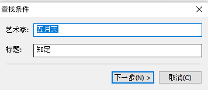

## How to get yourself some funcking local music files---Music Tag

最近被 Apple Music 对一些专辑和单曲的下架搞得十分恼火，有些在 Spotify 也逃不过下架的命运，未曾想过一直在日区和英区生活的数字移民也能有这般待遇。刚巧今天拿到了李志在日本发行的精选专辑的电子版，再加上先前顾老师把 My little airport 的全部歌曲打包给了我，就想着电脑本地存一份备份这件事不能再拖下去了，在软件选用和使用上饶了一大圈以后终于摸清了点逻辑，希望这篇文章能给你的本地化文件有些启发。

**注意：本篇并不实际探讨音乐文件的获取方式和途径，建议购买数字或实体版专辑来获取，线上购买推荐 iTunes Store。**

在正式管理一份音乐文件之前我们需要知道 「Music Tag」的概念，一份音乐文件并不止包含音乐文件本身，Music Tag 被写入在文件中用于表示这个音乐的**相关的曲名、演唱者、专辑、音轨数等信息**，在 Windows 系统中如果你右键一份音乐文件点开它的属性细节将能看到：  

 

能在属性信息中读到「专辑作者、单曲歌手、专辑名称、发行年份、在一张 CD 中的歌曲顺位、风格类型、时长」等等信息。然而由于获取这些文件的途径不同，每首歌曲的 Music Tag 往往会出现缺失、错误、乱码之类的情况。或许你有良好的文件整理习惯，花很长的时间把这些文件分门别类归类好，但一旦导入音乐播放器的时候就会发现徒劳无功，因为播放器往往识别的是歌曲本身的存储的分类信息，和它被你放在哪个文件夹中并无关系。比较常见的是港台歌手的名字，有时候你会在你的播放列表中看见三个不同的艺人：陈奕迅、陳奕迅和 Eason Chen，这类文件不进行修改他们的 Music Tag，整个播放列表会显得杂乱无章；另外还有来源非 CJK （Chinese,Japanese,Korean) 地区的 CJK 音乐，其中的歌曲歌手名往往会用罗马字母来表示，这一部分也是需要得到修正的。

在修正 Music Tag 部分我选用了几款推荐常用的免费软件后选择的是 [MP3TAG](https://www.mp3tag.de/en/ "With a Title"),它能读取大部分格式的乐曲信息，并且自带标签数据源，可以联网进行信息的核对.  

以这份五月天的《知足》文件为例，这份音乐文件来自于酷狗音乐，其中不带任何歌曲信息。

将其导入 MP3TAG 后选中，点击工具栏中[标签数据源]，可以选择联网查询数据源的方式，目前有 freedb,Discogs 和 MusicBrainZ，三个比较一下实际上只有 Discogs 能查询到大部分歌曲，并且提供多种查询方式，可以仅搜索专辑名或者艺术家名字加上歌曲标题名等等。  

    

这次我选择使用艺术家+标题名的方式进行检索：  

  

输入所需信息后会得到一个没有结果的提示：  

 

仔细检查自己并无输错，但是想想原理应该是软件去一个数据库中搜索，如果是调用外国软件的数据库，换成五月天的英文名尝试，果然能得到结果（并且依旧是中文）：

  

**Tip:建议养成保存歌曲信息时按照歌手本人的国家或地区来做显示语言的习惯，例如港澳台地区歌手名字和作品都使用正体中文，日本歌手使用假名和汉字而不使用罗马音。**

选择该单曲所在的专辑后点击下一步能看到在数据库中的相应的歌曲信息：

刚好，知足这首歌位于这张专辑发行时的第一张，不用调整顺序，直接点下一步，若是所要添加信息的文件不在该专辑的第一张请选中后手动点选旁边的 [上移、下移] 进行位置的对准。接下来就能看到刚刚我们全部缺失的专辑、年代、风格、顺序等信息全部补全上来，有时候数据库中的数据也不完全的时候也支援手动输入填写。

  

再保存之前，需要对标签的编码格式进行一下设置，点击 工具-选项 进入设置界面，在 Mpeg 的写入只勾选 [ID3V2,UTF-16] 确认后点选左上角的保存符号进行信息保存。

 

**Tip:如果你的电脑的语言或者地区选的不是中文地区，比如我电脑语言和地区都选择的是英文（英国），导致 Windows 系统在处理汉字时并不支援使用 Unicode 编码的格式，就会导致保存完 Music Tag 以后在系统的资源管理器查看时所有 CJK 文字都变成？问号。此时的解决方案是进入 Windows 的控制面板的 Region 选项中点击 Administrative 菜单，再点击 Change system locale 选项，将 (Beta):Use unicode UTF-8 for worldwide language support 勾选上，这时候你回去看文件夹的问号应该都正常显示 CJK 文字了。（除了骂微软一万遍希望它早点倒闭以外毫无办法）**

 

修改好了文件内建的 Music Tag 我们再对文件名进行下手，获得的文件根据来源不同可能会有不同的命名方式，比如一串乱码，或者[歌手名-歌名]、[歌名、歌手名]，一团乱糟糟的混合在一起，我们同样使用 Music Tag 进行调整。选中所需要更改的歌曲文件后点击工具栏内的[转换]：

 

第一项是[标签->文件名]，即使用我们刚刚获得的 Music Tag 来对我们的文件名进行重命名；后面的选项是根据文件本身的文件名对标签进行倒推，仅在需要的时候可以看情况使用。

 

文件重命名的格式使用 %——% 的形式来代表每一项目例如 [%artist% - %album% - %title%] 显示顺序为 [歌手 - 专辑名 - 歌名]，通过更改 %——% 的顺序来显示我们需要的文件名的显示形式。同样支持批量修改，意味着你可以在修改完所有的文件的 Music Tag 以后全选，按照同一种格式进行文件名的输出。

至此 How to get yourself some funcking local music files---Music Tag 的部分到这里就结束了，本文只介绍 [MP3TAG] 这款软件的基础操作和一些可能会遇到的问题，更多绝妙的操作可以在使用中慢慢体会。在现在流量无限的时代，流媒体很快很便捷，但是听歌的人是你自己，一旦碰上审查或是没有来由的下架，流媒体此时就毫无反手之力，网络年代也要有 CD 架子分门别类收藏的精神，Please get yourself some local music files，反正这个过程我是被各种奇奇怪怪的问题 fuck 了一遍又一遍，希望其他人能少走点弯路。

如果有时间的话，，How to get yourself some funcking local music files 下一期应该是写的本地音乐管理的问题，目前我依旧在熟悉使用 Music Bee 作为我的管理和播放器，体验很好，最后贴一张截图作为结尾了。

 